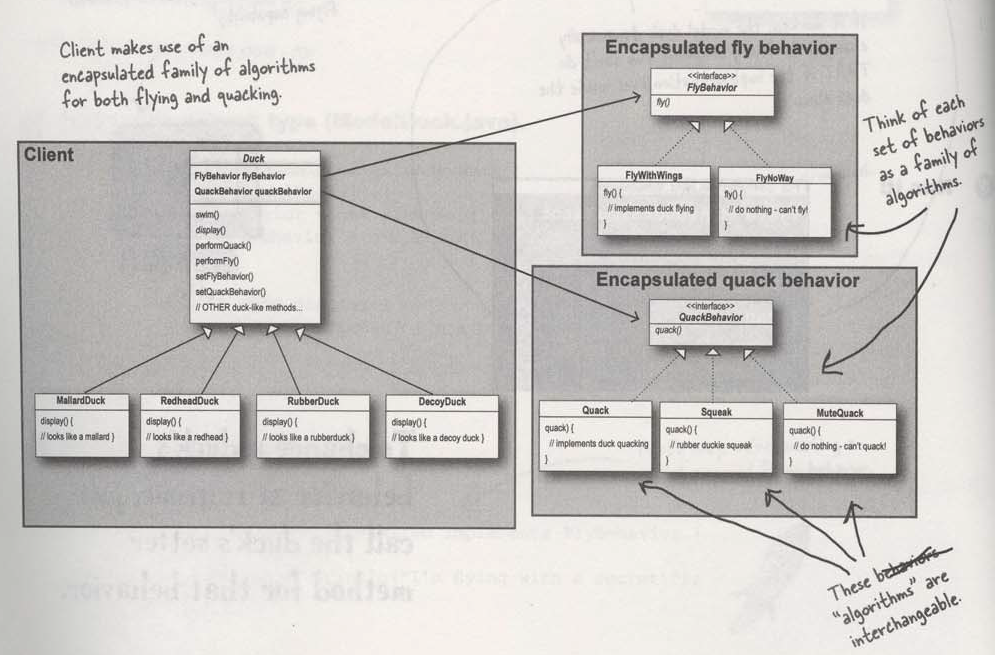
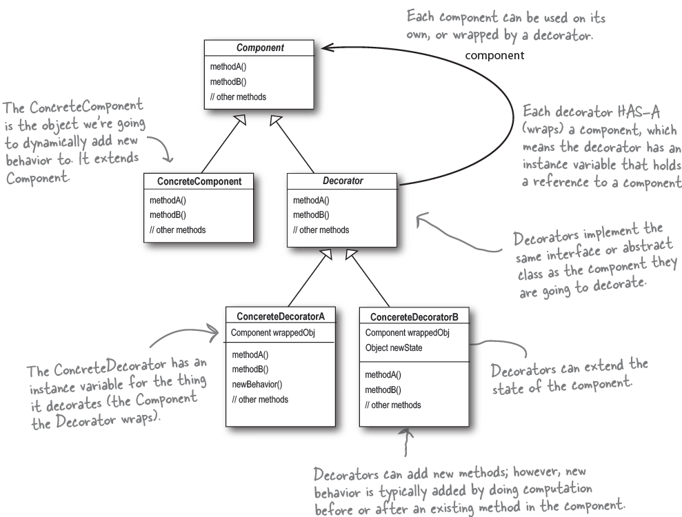
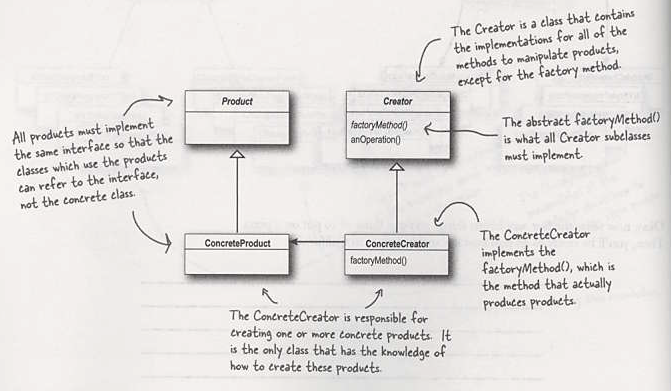
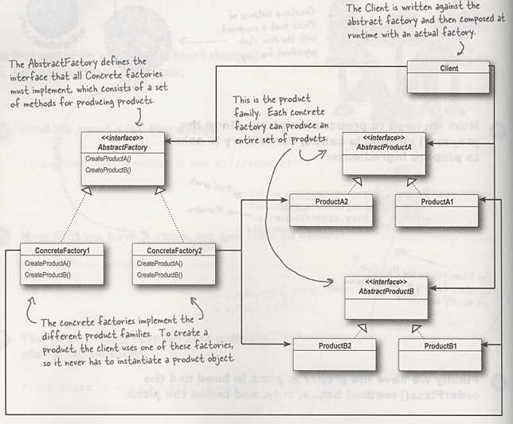

# Design Principles and Design Patterns
This is like a summary or the points from the Head First Design Patterns.
- Identify the aspects of your application that vary and separate them from what stays the same.
- Program to an interface, not implementation.
    > The above two principles are clearly use in state and strategy design patterns where we separate the behaviours or part of code that vary and encapsulate them into set of classes. And the separated and encapsulated code are used in the main or client code, and it is programmed to the interfaces of the set of class rather than the concrete classes which are implementation of the interface.
- Favor composition over inheritance. [ THis principle improves the flexibility of your code. ]
> <b>Strategy Design Pattern</b>
>> Strategy defines a family of algorithms, encapsulates each one, and makes them interchangeable. Strategy lets the algorithm vary independently from clients that use it [ means - we can dynamically change the algorithm or behaviour without touching the client code i.e. the composite class (duck class in our example). We have to ofcourse code the runner or main function to run it in the way we want i.e. to accept or change behaviours dynamially like we have to take inputs to set a behaviour of user's choice.]
> 

> <b>Observer Design Pattern</b>
>> Observer Pattern defines a one-to-many relationship between a set of objects. And when the state of one object changes, all of its dependent are notified.
> 

- Strive for loosely coupled designs between objects that interacts. [ When objects are loosely coupled, they can interact, but have very little knowledge about each other. In the observer pattern, the only thing the subject knows about the observer is that it implements a certain interface and vice versa.]
- Classes should be open for extension but closed for modification. [ Our goal is to allow classes to be easily extended to incorporate new behaviour without modifying the existing code. If we accomplish this - we'll get designs that are resilient to change and flexible enough to take on new functionality to meet changing requirements. However applying this principle to everywhere can lead to complex, hard to understand code. ]

> <b>Decorator Pattern</b>
>> Decorator pattern attaches additional responsibility to an object dynamically. Decorator provide a flexible alternative to subclassing for extending functionality.   

> <b>Factory Method Pattern</b>
> > Factory method defines an interface for creating an object, but lets subclasses decide which class to instantiate. Factory method lets a class defer instantiation to its subclasses.
> 

- Dependency Inversion principle states that high level components shouldn't depend on low level components, both should depend on abstraction. Depend on abstraction. Do not depend on concrete class.

> <b>Abstract Factory pattern</b>
> > Abstract factory provides an interface to create a family of related products without specifying their concrete class.
>  Here, in our example of pizza store, PizzaStore will be the client code.